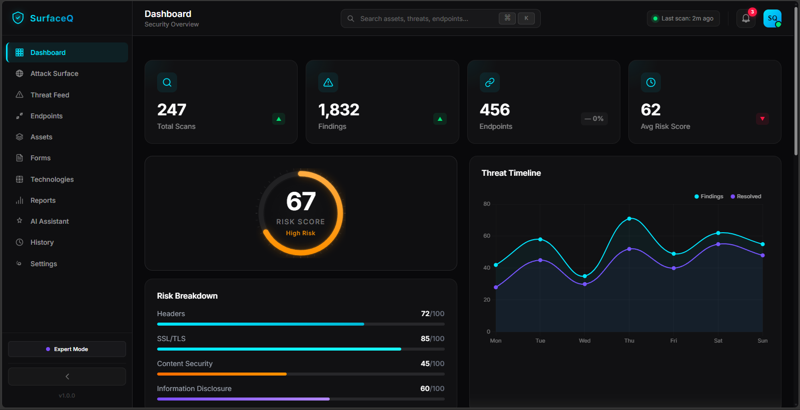

# Surface-Q 🛡️
**Passive Attack Surface Discovery & AI-Powered Security Intelligence**

Surface-Q is an open-source, passive security scanning tool consisting of a Chrome Extension and an AI-powered Dashboard. It analyzes your web attack surface in real-time without sending malicious payloads, ensuring zero disruption to the target servers.

## 📌 Problem Statement
Traditional DAST (Dynamic Application Security Testing) tools are aggressive, noisy, and frequently cause disruptions (e.g., submitting form data, triggering rate limits, polluting databases). Developers and bug bounty hunters need a way to understand the technology stack, security headers, form configurations, and potential risks of a website *passively*, before engaging in active testing.

## 🚀 Why Surface-Q Exists
Surface-Q bridges the gap between manual inspection and active scanning by automating the collection of front-end telemetry and using LLMs (Gemini/Groq) to intelligently score the risk profile of the application based on its passive footprint.

## ✨ Key Features
* **Zero-Impact Passive Scanning:** No malicious payloads sent. Purely observational via browser DOM and Network analysis.
* **Chrome Extension (Manifest V3):** Collects headers, scripts, forms, and tech stacks directly from your browsing session.
* **AI-Powered Threat Assessment:** Uses Google Gemini (or Groq) to analyze the collected telemetry and provide a Security Risk Score.
* **Dynamic vs Static Architecture Detection:** Intelligently determines if a site is a static SPA or a dynamic server-rendered app.
* **Premium Dashboard:** A real-time, glassmorphic telemetry dashboard to view findings, complete with a live-feed and chat interface.
* **Simple vs Expert Mode:** Toggle between high-level safety checks and deep-dive technical reports.
* **Professional PDF Reporting:** Export your security assessment findings into a beautiful, commercial-grade PDF directly from the dashboard.

## 🏗 Architecture
Surface-Q operates on a decoupled architecture, using a local Node.js server as the bridge between the browser extension and the UI dashboard.
(See `docs/ARCHITECTURE.md` for the detailed Mermaid diagrams and data flow).

## 📂 Folder Structure
(See `docs/PROJECT_STRUCTURE.md` for a comprehensive breakdown).
- `/extension` - Chrome Extension (Manifest V3)
- `/server` - Local Node.js server for AI integration
- `/assets` - CSS, JS, and Images for the frontend UI
- `index.html` - Premium Landing Page
- `dashboard.html` - The telemetry and findings dashboard

## 🛠 Installation & Setup
Please refer to [SETUP.md](SETUP.md) for detailed instructions on how to install the extension and start the backend server.

## 🧪 Testing
We use Playwright for end-to-end integration testing. Please refer to [TESTING.md](TESTING.md) for execution details.

## 🤝 Contributing
We welcome contributions! Please review our [CONTRIBUTING.md](CONTRIBUTING.md) guide before submitting pull requests.

## 🤖 AI Tools Disclosure
This project uses AI (Google Gemini / Groq) for security analysis. For details on how AI is used and its limitations, please read the [AI_DISCLOSURE.md](AI_DISCLOSURE.md).

## 🔒 Security & Privacy Statement
Surface-Q operates entirely on your local machine. No browsing data is sent to central servers other than the explicit AI API endpoints you configure. 

## 🛣 Future Roadmap
- Implementation of active vulnerability scanning modules.
- Continuous monitoring via background polling.

## 📄 License
This project is licensed under the MIT License. See the [LICENSE](LICENSE) file for details.
