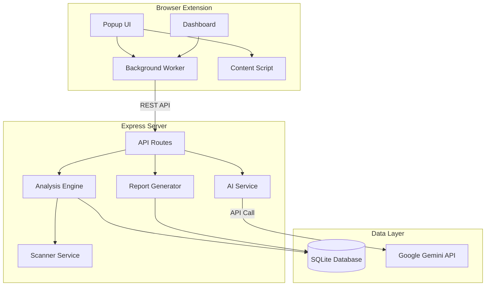
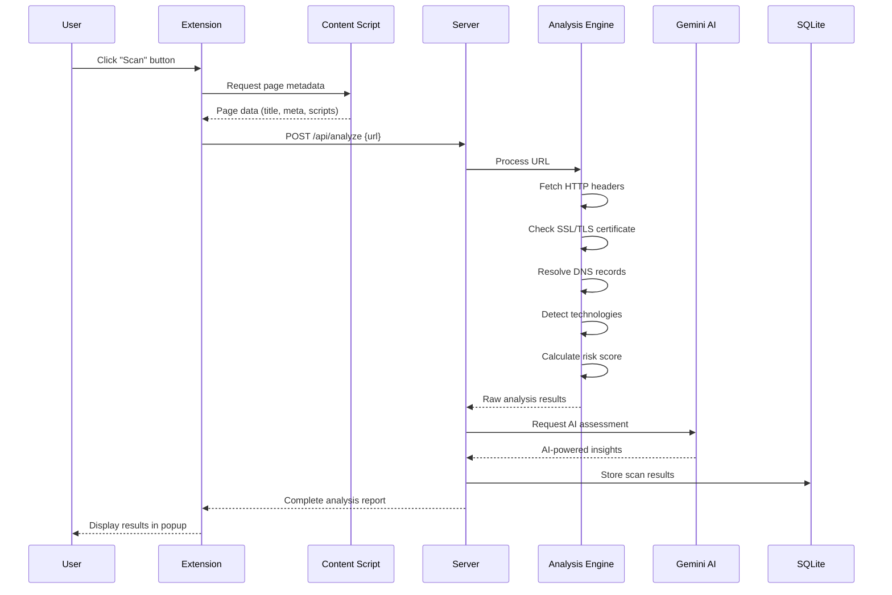
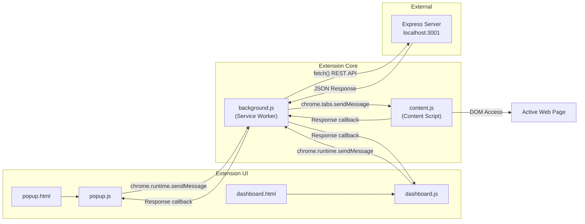
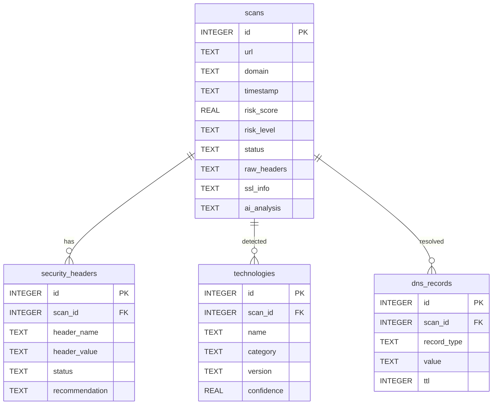

# SurfaceQ Architecture

SurfaceQ follows a **three-tier architecture** designed for modularity, security, and extensibility. The system separates concerns across a browser extension frontend, an Express.js backend server, and a SQLite data persistence layer. This architecture enables rapid surface-level security analysis of any website while maintaining a clean separation between the user interface, business logic, and data storage. Each tier communicates through well-defined interfaces, making the system easy to maintain, test, and extend.

---

## System Overview

The following diagram illustrates the high-level architecture and communication flow between the three primary tiers of the SurfaceQ platform:

---

## Component Architecture

### Extension Layer

The browser extension is the primary user-facing interface, built with Manifest V3 standards and consisting of four interconnected components:

| Component | File(s) | Responsibility |
|-----------|---------|---------------|
| **Popup UI** | `popup.html`, `popup.js`, `popup.css` | Provides a compact, React-like interface for initiating scans, viewing results, and navigating to the dashboard. Renders real-time scan progress and summary cards for risk scores, headers, and technologies. |
| **Background Worker** | `background.js` | Operates as a Manifest V3 service worker. Manages extension lifecycle events, handles communication between the popup/dashboard and the backend server, caches recent scan results, and manages badge icon updates based on risk level. |
| **Content Script** | `content.js` | Injected into active web pages to extract client-side metadata including page title, meta tags, script sources, link elements, and DOM-based technology fingerprints. Communicates findings back to the background worker via Chrome messaging API. |
| **Dashboard** | `dashboard.html`, `dashboard.js`, `dashboard.css` | A full-page analytics interface accessible from the popup. Displays scan history, trend charts, comparative analysis, and detailed reports. Supports filtering, sorting, and exporting scan data. |

### Server Layer

The Express.js backend handles all heavy computation, external API communication, and data persistence:

| Component | Description |
|-----------|-------------|
| **Express.js Server** | Core HTTP server running on port 3001 (configurable). Implements middleware for CORS, rate limiting, request validation, and error handling. |
| **API Routes** | RESTful endpoint handlers organized by domain: `/api/analyze` (scan initiation), `/api/history` (scan retrieval), `/api/reports` (report generation), `/api/ai` (AI-powered analysis). |
| **Scanner Service** | Performs multi-vector analysis including HTTP header inspection, SSL/TLS certificate validation, DNS record resolution, and technology fingerprinting via signature matching. |
| **AI Service** | Interfaces with the Google Gemini API to generate natural-language security assessments, vulnerability summaries, and actionable recommendations based on raw scan data. |
| **Database Service** | Manages all interactions with the SQLite database including schema initialization, CRUD operations for scans and related records, and query optimization. |

### Data Layer

| Component | Technology | Purpose |
|-----------|-----------|---------|
| **SQLite Database** | `better-sqlite3` | Local persistent storage for all scan results, security headers, detected technologies, and DNS records. Chosen for zero-configuration deployment and excellent read performance. |
| **Tables** | — | `scans` (primary scan records), `security_headers` (per-scan header analysis), `technologies` (detected tech stack), `dns_records` (resolved DNS entries). |
| **Google Gemini API** | External REST API | Provides AI-powered security insights, threat assessments, and natural-language recommendations. |

---

## Data Flow

The following sequence diagram details the complete lifecycle of a security scan from user initiation to result display:

### Flow Description

1. **User Initiation**: The user clicks the "Scan" button in the extension popup while on any webpage.
2. **Metadata Collection**: The extension sends a message to the content script injected into the active tab. The content script scrapes client-side metadata (page title, meta tags, external scripts, link elements) and returns it to the extension.
3. **Server Request**: The background worker sends a `POST /api/analyze` request to the Express server with the target URL and any collected metadata.
4. **Multi-Vector Analysis**: The Analysis Engine performs several concurrent checks:
   - **HTTP Headers**: Fetches and evaluates security-relevant response headers (CSP, HSTS, X-Frame-Options, etc.)
   - **SSL/TLS**: Validates the site's SSL certificate chain, expiration, protocol version, and cipher strength.
   - **DNS Resolution**: Resolves A, AAAA, MX, TXT, NS, and CNAME records for the domain.
   - **Technology Detection**: Matches response patterns against a signature database to identify frameworks, CMS, CDNs, and server software.
   - **Risk Scoring**: Aggregates all findings into a normalized risk score (0–100) with a categorical risk level.
5. **AI Enhancement**: Raw results are sent to Google Gemini for natural-language analysis, producing a human-readable summary, vulnerability assessment, and prioritized recommendations.
6. **Data Persistence**: Complete scan results are stored in SQLite for historical analysis and reporting.
7. **Result Display**: The full analysis report is returned to the extension and rendered in the popup UI.

---

## Extension Architecture

The following diagram shows the internal structure and message flow within the browser extension:

### Messaging Patterns

| Pattern | Sender | Receiver | Method | Purpose |
|---------|--------|----------|--------|---------|
| Scan Request | `popup.js` | `background.js` | `chrome.runtime.sendMessage` | Initiate a new scan for the active tab |
| Page Data Request | `background.js` | `content.js` | `chrome.tabs.sendMessage` | Request metadata from the active page |
| Page Data Response | `content.js` | `background.js` | Response callback | Return scraped page metadata |
| API Communication | `background.js` | Express Server | `fetch()` | Send/receive scan data via REST API |
| Result Update | `background.js` | `popup.js` | Response callback | Return scan results for display |
| History Request | `dashboard.js` | `background.js` | `chrome.runtime.sendMessage` | Request scan history and analytics data |

---

## Database Schema

### Table Descriptions

#### `scans`
The primary table storing top-level scan results. Each row represents a single security scan of a URL.

| Column | Type | Description |
|--------|------|-------------|
| `id` | INTEGER | Auto-incrementing primary key |
| `url` | TEXT | Full URL that was scanned |
| `domain` | TEXT | Extracted domain name for grouping and filtering |
| `timestamp` | TEXT | ISO 8601 timestamp of when the scan was performed |
| `risk_score` | REAL | Calculated risk score from 0.0 (safe) to 100.0 (critical) |
| `risk_level` | TEXT | Categorical risk level: `low`, `medium`, `high`, or `critical` |
| `status` | TEXT | Scan status: `completed`, `failed`, or `pending` |
| `raw_headers` | TEXT | JSON-serialized raw HTTP response headers |
| `ssl_info` | TEXT | JSON-serialized SSL/TLS certificate details |
| `ai_analysis` | TEXT | JSON-serialized AI-generated analysis from Gemini |

#### `security_headers`
Stores individual security header evaluations for each scan.

| Column | Type | Description |
|--------|------|-------------|
| `id` | INTEGER | Auto-incrementing primary key |
| `scan_id` | INTEGER | Foreign key referencing `scans.id` |
| `header_name` | TEXT | Name of the security header (e.g., `Content-Security-Policy`) |
| `header_value` | TEXT | Actual value found, or `null` if missing |
| `status` | TEXT | Evaluation status: `present`, `missing`, or `misconfigured` |
| `recommendation` | TEXT | Actionable recommendation for improving this header |

#### `technologies`
Records technologies detected on the scanned website.

| Column | Type | Description |
|--------|------|-------------|
| `id` | INTEGER | Auto-incrementing primary key |
| `scan_id` | INTEGER | Foreign key referencing `scans.id` |
| `name` | TEXT | Technology name (e.g., `React`, `nginx`, `Cloudflare`) |
| `category` | TEXT | Category: `framework`, `server`, `cdn`, `cms`, `analytics`, etc. |
| `version` | TEXT | Detected version string, if available |
| `confidence` | REAL | Detection confidence from 0.0 to 1.0 |

#### `dns_records`
Stores resolved DNS records for the scanned domain.

| Column | Type | Description |
|--------|------|-------------|
| `id` | INTEGER | Auto-incrementing primary key |
| `scan_id` | INTEGER | Foreign key referencing `scans.id` |
| `record_type` | TEXT | DNS record type: `A`, `AAAA`, `MX`, `TXT`, `NS`, `CNAME` |
| `value` | TEXT | Resolved record value |
| `ttl` | INTEGER | Time-to-live in seconds |

---

## Security Model

SurfaceQ is designed with a security-first approach across all tiers of the architecture:

### Passive Analysis Only

SurfaceQ performs **strictly passive reconnaissance**. The system never attempts to exploit vulnerabilities, inject payloads, or perform any active penetration testing. All analysis is limited to:

- Reading publicly accessible HTTP response headers
- Validating publicly visible SSL/TLS certificates
- Resolving standard DNS records
- Fingerprinting technologies from public response data

This passive approach ensures SurfaceQ is safe to use on any website without risk of triggering security alerts or violating computer fraud laws.

### API Key Authentication

All server API endpoints (except `/health`) require authentication via the `X-API-Key` header. The key is validated against the server-side configured value before any request is processed. Unauthenticated requests receive a `401 Unauthorized` response.

### CORS Restrictions

The Express server implements strict CORS policies that restrict API access to:
- The browser extension origin (`chrome-extension://`)
- Explicitly configured allowed origins via environment variables

This prevents unauthorized web applications from accessing the SurfaceQ API.

### Rate Limiting

All API endpoints are protected by rate limiting (default: 100 requests per 15-minute window per IP). Rate limit status is communicated via standard headers:
- `X-RateLimit-Limit`: Maximum requests allowed
- `X-RateLimit-Remaining`: Requests remaining in the current window
- `X-RateLimit-Reset`: Timestamp when the rate limit window resets

### No PII Collection

SurfaceQ does not collect, store, or transmit any personally identifiable information. The system only stores:
- URLs and domains that were scanned
- Technical metadata about the scanned sites
- AI-generated analysis text

No user accounts, browsing history, cookies, or personal data are ever captured.

### Server-Side API Key Storage

The Google Gemini API key is stored exclusively on the server side in environment variables. The key is never exposed to the browser extension, transmitted to the client, or logged in any output. This prevents API key leakage through browser DevTools, extension source inspection, or network traffic analysis.

---

## Technology Stack Summary

| Layer | Technology | Version | Purpose |
|-------|-----------|---------|---------|
| Extension | Chrome Manifest V3 | V3 | Browser extension framework |
| Extension UI | HTML/CSS/JS | ES2022 | User interface rendering |
| Server | Node.js | 18+ | Runtime environment |
| Server Framework | Express.js | 4.x | HTTP server and routing |
| Database | SQLite | 3.x | Local data persistence |
| Database Driver | better-sqlite3 | 9.x | Synchronous SQLite bindings |
| AI | Google Gemini API | 1.5+ | Natural-language security analysis |
| HTTP Client | node-fetch / axios | — | Server-side HTTP requests |
| DNS | Node.js `dns` module | Built-in | DNS record resolution |
| TLS | Node.js `tls` module | Built-in | SSL/TLS certificate inspection |
